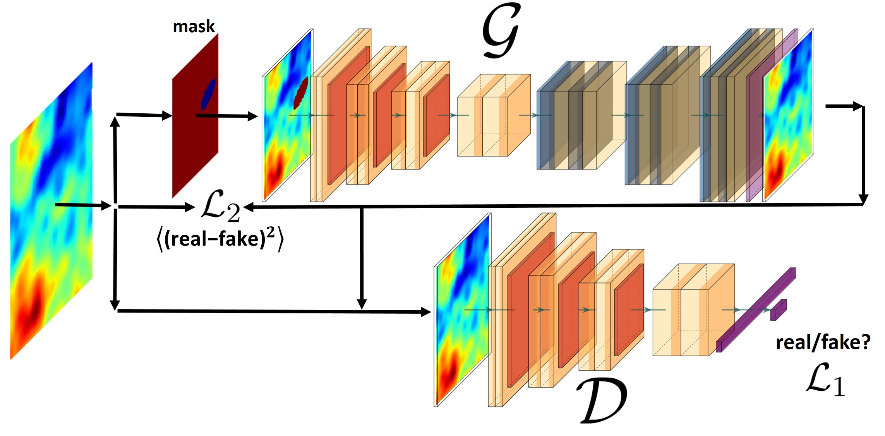
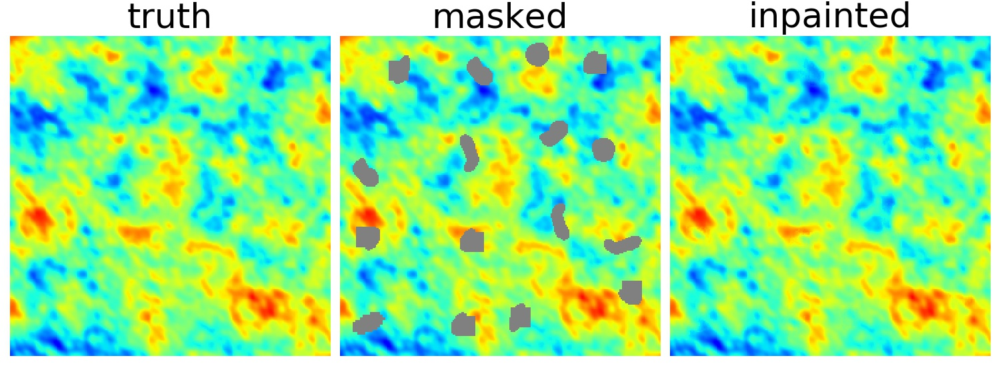

CMB-GAN
=======


CMB-GAN is a package to fill what we missed in Cosmic Microwave Backround.

**Important**
I did not find a chance to make it like a package, sorry if the codes are a bit confusing. Don't hesitate to ask if there was any problem, question, etc.

**CMB-GAN** is a flexible and expendable inpaintation code for CMB data. 

<p align="center">
  
</p>


<p align="center">
  
</p>


<!--_Python library for _-->


**Citing CMB-GAN:** 
```  
@article{Sadr:2020rje,
    author = "Sadr, Alireza Vafaei and Farsian, Farida",
    title = "{Filling in Cosmic Microwave Background map missing regions via Generative Adversarial Networks}",
    eprint = "2004.04177",
    archivePrefix = "arXiv",
    primaryClass = "astro-ph.CO",
    doi = "10.1088/1475-7516/2021/03/012",
    journal = "JCAP",
    volume = "03",
    pages = "012",
    year = "2021"
}
```
